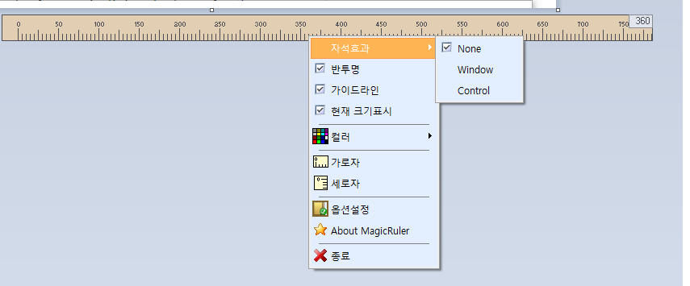

# MagicRuler

MagicRuler는 Windows 화면 위에 항상 표시되는 작은 픽셀 자 프로그램입니다.

MagicRuler is a small always-on-top pixel ruler for Windows.

## 한국어

### 주요 기능

- 가로자 / 세로자 모드
- 시작 위치와 단위 간격 설정
- 반투명 표시
- 현재 커서 위치 표시
- 측정 대상 가이드라인 표시
- Magnetic 모드
  - `None`: 일반 자 모드
  - `Window`: 마우스 위치의 윈도우 기준으로 자동 부착
  - `Control`: 마우스 위치의 컨트롤 핸들 기준으로 자동 부착
- 한국어 / 영어 UI 지원

### 언어 파일

UI 문구는 실행 파일과 같은 폴더의 UTF-8 `key=value` 언어 파일에서 읽습니다.

- `Kor.lang`: 한국어
- `Eng.lang`: 영어

팝업 메뉴에서 언어를 변경할 수 있습니다.

`언어 > 한국어` 또는 `Language > English`

선택한 언어는 레지스트리에 저장되며 다음 실행 때 다시 적용됩니다.

### 사용 방법

- 자 위에서 마우스 오른쪽 버튼을 누르면 팝업 메뉴가 열립니다.
- 팝업 메뉴에서 가로자 / 세로자 모드를 선택합니다.
- `자석효과 > 윈도우` 또는 `자석효과 > 컨트롤`을 선택하면 마우스 아래 대상에 자동으로 붙어 크기를 측정합니다.
- `옵션설정`에서 색상, 시작 위치, 단위, Magnetic 타입, 현재 위치 표시를 설정합니다.
- `Ctrl + \`` 키로 현재 마우스 위치의 Magnetic 대상에 수동으로 맞출 수 있습니다.
- `Shift + 방향키`로 자를 1픽셀씩 이동할 수 있습니다.

### 빌드

대상 환경:

- Delphi 12
- Windows VCL Application

Delphi에서 `MagicRuler.dpr`을 열어 빌드합니다.

배포 시 실행 파일과 함께 아래 언어 파일을 포함해야 합니다.

- `Kor.lang`
- `Eng.lang`

### 참고

Windows 10 이후 환경에서 `Window` Magnetic 모드는 DWM extended frame bounds를 사용합니다. 그래서 보이지 않는 resize border 영역을 제외하고 실제 보이는 윈도우 영역 기준으로 측정합니다.

## English

### Features

- Horizontal and vertical ruler modes
- Configurable start position and unit interval
- Alpha blended ruler window
- Current cursor position display
- Guide lines for measured targets
- Magnetic mode
  - `None`: normal ruler behavior
  - `Window`: automatically attaches to the window under the mouse
  - `Control`: automatically attaches to the control handle under the mouse
- Korean and English UI support

### Language Files

UI text is loaded from UTF-8 `key=value` language files placed next to the executable.

- `Kor.lang`: Korean
- `Eng.lang`: English

You can switch languages from the popup menu.

`Language > Korean` or `Language > English`

The selected language is saved in the registry and restored on the next run.

### Usage

- Right-click the ruler to open the popup menu.
- Select horizontal or vertical ruler mode from the popup menu.
- Select `Magnetic > Window` or `Magnetic > Control` to automatically attach the ruler to the target under the mouse and measure its size.
- Use `Options` to change color, start position, unit interval, Magnetic type, and current position display.
- Press `Ctrl + \`` to manually snap to the current Magnetic target.
- Hold `Shift` and use the arrow keys to move the ruler by 1 pixel.

### Build

Target environment:

- Delphi 12
- Windows VCL Application

Open and build `MagicRuler.dpr` in Delphi.

When distributing the program, include these language files next to the executable:

- `Kor.lang`
- `Eng.lang`

### Notes

On Windows 10 and later, `Window` Magnetic mode uses DWM extended frame bounds. This excludes the invisible resize border and measures the visible window bounds.
